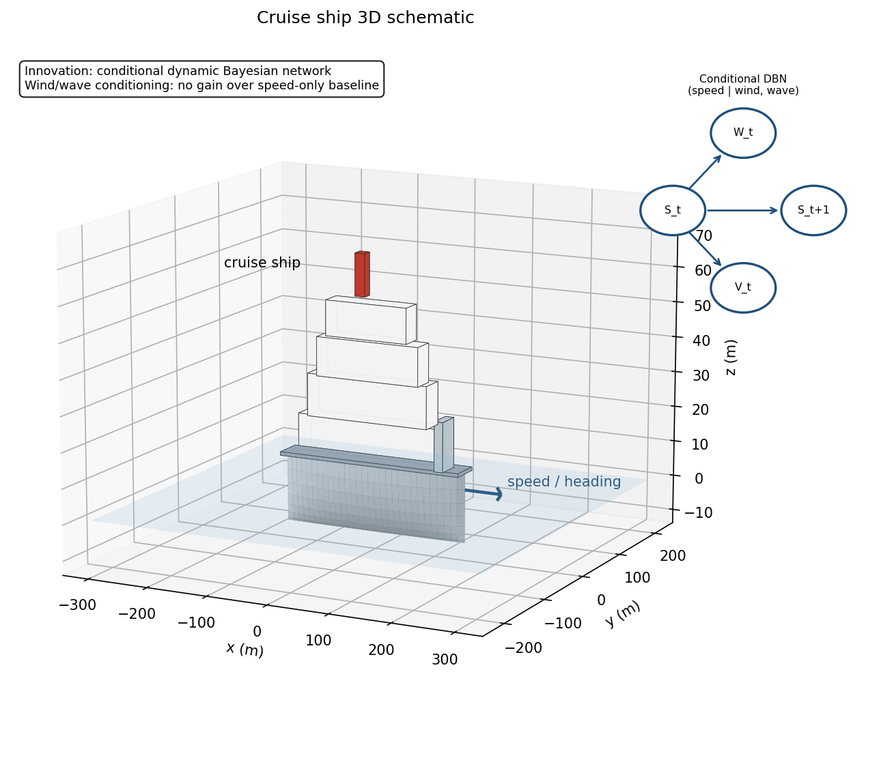
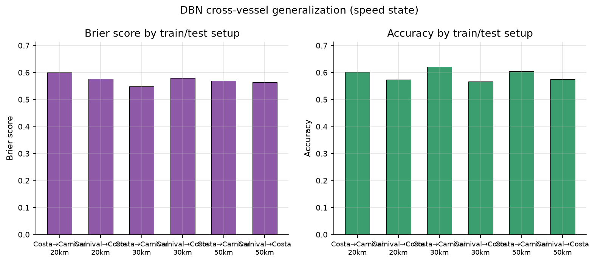

# 邮轮速度状态 DBN 与数据可识别性

## 效果展示

  
  

## 问题与方法

原研究从邮轮试航风险分析出发，实证部分收紧为双船的可观测速度状态动态，而非事故预测。对 Costa Toscana 与 Carnival Celebration 使用训练船速度三分位阈值，估计一小时时片条件频率，比较速度、速度＋风、速度＋浪、速度＋风浪四种模型。阈值只由训练数据确定；未观测环境条件行退回速度基线，不添加伪计数。

## 实际复现

在根目录运行 `python src/demo.py && python src/verify.py`。`src/dbn.py` 为可用的条件计数模型与回退示例；`verify.py` 从原预测结果转换出的聚合评分组复算六个分析方向与距离设置下的 **24 组 Brier 和 accuracy**。

| 30 km 匹配，训练→测试 | 窗口数 | 速度 Brier | 速度＋风浪 Brier |
| --- | --- | ---: | ---: |
| Costa→Carnival | 67→124 | 0.5491 | 0.6048 |
| Carnival→Costa | 124→67 | 0.5795 | 0.6028 |

Brier 越低越好；风浪联合模型在本分析未取得优势。Costa 训练方向 12 种风浪条件组合中 1 行未观测、6 行仅 1–5 次转移，反向有 5 行仅 1–5 次。该稀疏性支持诊断，不能单独证明性能下降的因果原因。

## 证据边界

只有两艘船及相邻时段，重叠窗口相互依赖。SOG 状态不是故障或事故状态；风浪为事后环境模型产品，不是船载测量。当前海流缺失，未进入联合模型。本包去除原记录时间戳并合并相同评分输入，没有原 AIS 轨迹；不能从评分组重新拟合模型或重新匹配环境数据。

后续应先补可公开的数据取得流程、独立事故/故障标签和更多独立船舶，再评估工程风险概率。环境产品入口：[Open-Meteo 历史天气 API](https://open-meteo.com/en/docs/historical-weather-api)、[海洋 API](https://open-meteo.com/en/docs/marine-weather-api)。

## Figures

Regenerate with `python figures/make_figures.py` (needs `matplotlib`, `pandas`, `numpy`).

### 3D schematic illustration

Schematic illustration rendered in Python (matplotlib) - not ANSYS/Fluent/STAR-CCM+ output. Regenerate with `python figures/make_3d_schematic.py` (needs `matplotlib`, `numpy`). The cruise-ship hull and superstructure illustrate the vessel class whose speed states this project predicts from AIS data.
